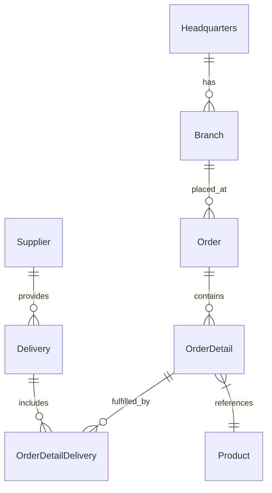

# 🚀 OctoCAT Supply: The Ultimate GitHub Copilot Demo v4.5.4


Welcome to the OctoCAT Supply Website - your go-to demo for showcasing the incredible capabilities of GitHub Copilot, GHAS, and the power of AI-assisted development!


## 🏗️ Architecture

The application is built using modern TypeScript with a clean separation of concerns:



### Tech Stack

- **Frontend**: React 18+, TypeScript, Tailwind CSS, Vite

- **Backend**: Express.js, TypeScript, SQLite, OpenAPI/Swagger

- **Data**: SQLite (file db at `api/data/app.db`; in-memory for tests)
- **DevOps**: Docker

## 🚀 Getting Started

### Prerequisites

- Node.js 18+ and npm


### Quick Start

1. Clone this repository

2. Install dependencies: Open a terminal in the project root and run:

   ```bash
         npm run install:all
       
   ```

3. Start the development environment:

   ```bash
         npm run dev
   ```

This will start both the API server (on port 3000) and the frontend development server (on port 5137).

If you have `make` installed, you can also use the following commands in a bash terminal:

```bash
make install
make dev
```
### Available Make Commands

View all available commands:

```bash
make help
```

Key commands:

- `make dev` - Start both API and frontend development servers
- `make dev-api` - Start only the API server
- `make dev-frontend` - Start only the frontend server
- `make build` - Build both API and frontend for production
- `make db-init` - Initialize database schema
- `make db-seed` - Seed database with sample data
- `make test` - Run all tests
- `make clean` - Clean build artifacts and dependencies

### Database Management

Initialize the database explicitly (migrations + seed):

```bash
make db-init
```

Seed data only:

```bash
make db-seed
```


Or use npm scripts directly in the API directory:

```bash
cd api && npm run db:migrate  # Run migrations only
cd api && npm run db:seed     # Seed data only
```


## 📚 Documentation

- [Detailed Architecture](./docs/architecture.md)
- [SQLite Integration](./docs/sqlite-integration.md)
- [Complete Demo Script](./demo/walkthroughs/README.md)

Database defaults and env vars:

- DB file: `api/data/app.db` (override with `DB_FILE=/absolute/path/to/file.db`)
- Enable WAL: `DB_ENABLE_WAL=true` (default)
- Foreign keys: `DB_FOREIGN_KEYS=true` (default)

---

*This entire project, including the hero image, was created using AI and GitHub Copilot! Even this README was generated by Copilot using the project documentation.* 🤖✨
